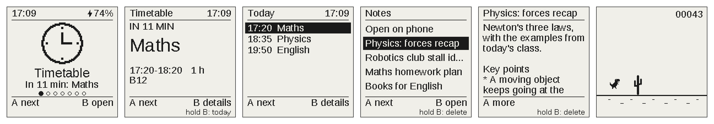

# unidex

**A pocket e-ink OS for the Waveshare ESP32-S3 1.54" e-paper board.** It does six things:

- shows your next class with a live countdown;
- records voice notes, tidied into Markdown for Obsidian;
- keeps a little Pet you dress up, which meets your friends' Pets on their unidex (they visit, chat and swap badges);
- flips through name badges;
- runs a WiFi collection game and four one-button games;
- sleeps whenever you aren't pressing a button, and looks after its battery and your files.

It runs on two buttons and a battery, and its code is public: free to use, fork and improve for non-commercial use.
Install it from your browser in a minute, with no tools to set up.

**Don't have the board?** A fully assembled and tested unidex is available to pre-order in the UK at
[unidex-site.vercel.app](https://unidex-site.vercel.app).

<p>
  <a href="https://github.com/Forrest404/unidex/releases/latest"></a>
  <a href="LICENSE"></a>
  <a href="https://forrest404.github.io/unidex/"></a>
  <a href="https://unidex-site.vercel.app"></a>
</p>



| App | What it does |
|---|---|
| **Timetable** | Your next class or calendar event with a live countdown, and today's list. |
| **Notes** | Hold a button and talk: the note is transcribed, tidied up and saved, and can go to GitHub for Obsidian. |
| **Pet** | A cute creature you dress up and name. Bring two unidex together and the Pets visit, chat, become friends and swap badges. |
| **Badge** | Full-screen name tags, logos and photos. |
| **Dex** | A WiFi collection game: every new network name nearby is logged with a rarity. |
| **Chooser** | Pick 2–6 squares, spin, get a random winner. |
| **Games** | Four one-button games: Flappy, Dino, Stack and Jetpack, with best scores. |
| **Settings** | Date and time, sleep, invert, battery and info, reset data, factory reset. |

**New in v1.6:** it protects a low battery (and switches off when it's flat), saves files so a full card or a
power cut doesn't lose what was already saved, restarts by itself if it ever freezes, has a factory reset for
passing it on, welcomes a new owner with the buttons and a link to the website, and keeps your Pet's friends on the
SD card. Every change: [CHANGELOG.md](CHANGELOG.md).

If unidex is useful to you, a star on GitHub helps other people find it.

## Getting started

**You need:**

- the [Waveshare ESP32-S3-ePaper-1.54](https://docs.waveshare.com/ESP32-S3-ePaper-1.54) board, **V2** (or a
  [ready-made unidex](https://unidex-site.vercel.app));
- a USB-C **data** cable and a computer with Chrome or Edge;
- a **micro SD card** (FAT32) for your files;
- optional: a 3.7 V LiPo battery on the board's battery connector, to use it away from USB.

**Then:**

1. **Install:** open **https://forrest404.github.io/unidex/**, plug the board in, press one of its buttons so it's
   awake, and click **Install**. Nothing to download. The first time it starts, it shows the buttons and a QR code
   for the website.
2. **SD card:** copy the contents of the [`starter`](starter) folder to the card (a few badges and an empty
   timetable) and put it in the board's slot.
3. **Your timetable:** send your calendar from the website's [Tools](https://forrest404.github.io/unidex/tools.html)
   page, or edit `timetable.csv` on the card (see [Timetable](#timetable)).
4. **Voice notes (optional):** set up WiFi and your API keys on the
   [Notes](https://forrest404.github.io/unidex/notes.html) page (see [Notes](#notes)).

## The buttons

Two buttons: **A** (BOOT) and **B** (PWR). They mean the same thing everywhere:

| Press | Meaning |
|---|---|
| A | next (row, item, page) |
| B | select / open / do |
| hold A | back; from an app, home; on the home screen, the previous app |
| hold B | the screen's extra (shown at the bottom, e.g. `hold B: delete`) |

Every screen shows what A and B do along the bottom. Anything that can't be undone asks first (A keeps, B goes
ahead), and short messages ("Clock set", "Deleted") pop up for a moment.

The home screen shows one app at a time with a live line under it ("In 12 min: Maths", "3 notes", "Mochi,
2 friends"); A moves to the next app, B opens it. The top right shows the time and battery (`14:32 87%`); a small
lightning bolt means it's on USB power.

- **Sleep:** after a few seconds without a press (10 s, or as set in Settings) it goes to sleep. The screen keeps
  showing what it last drew; any button wakes it. It stays awake on USB and while a note is still sending.
- **Restart:** hold **A and B together for 1 second**, then let go. Your files, settings and the clock are kept.

## The apps

### Timetable

Your next class or event: "IN 42 MIN" / "NOW, UNTIL 16:00" / "TOMORROW 09:30", the title, the time, the room, and
what comes next. **A** = the next one, **B** = details (date, time, room, notes), **hold B** = today's list.

Classes that repeat every week go in `timetable.csv` on the SD card:

```csv
day,start,end,module,room
Mon,09:00,10:00,Maths,B12
Wed,18:00,19:30,Robotics Club,Lab 1
```

Calendar events (Apple, Google, Outlook...) come from the website's Tools page: export a `.ics` file from your
calendar and send it, or let **Sync everything** send it each time you plug in. On a Mac, the automatic calendar
sync on the Tools page sends your calendar whenever the board is plugged in and awake. The time zone is London.

### Notes

**Hold B** and talk; let go to stop (up to 3 minutes). You're back on the screen in about a second; the rest happens
in the background, with progress on screen:

1. the recording is **transcribed** (OpenAI Whisper, about $0.006 a minute),
2. **tidied up** (OpenAI or Claude, or not at all): a title, a one-line summary, a clean version that keeps every
   fact, topics, and a calendar event if you described a dated plan,
3. **saved** to the SD card as Markdown next to the recording, and
4. if you switch it on, **sent to your GitHub repo**, ready for Obsidian.

**B** on the Notes screen sends anything still waiting; **A** opens the list (**B** opens a note, **hold B** deletes
it). **Open on phone** shows a QR code: join the device's own WiFi and browse, search, share and copy your notes on
your phone.

Set it up on the [Notes page](https://forrest404.github.io/unidex/notes.html): WiFi (including eduroam and work
networks), your OpenAI key, which model tidies up (and an Anthropic key for Claude), and GitHub (a repo and a
[fine-grained token](https://github.com/settings/personal-access-tokens/new) with Contents: Read and write on that
repo only). Each has a **Test** button. Your keys stay on the device: the page can't read them back, and they're
never in the code or on the card. Treat the device like an unlocked phone: anyone holding it could use them.

### Pet

A cute creature built from a body (blob, cat, bear, bunny, frog, robot), eyes, a mouth, a hat and an extra. It blinks
every few seconds, and **A** says hi. **B** = Dress up: **A** moves between rows, **B** changes the part, **hold B**
goes back one. The **Name** row names it a letter at a time; the name shows as a tag over its head. You can also
dress it up and name it with a mouse on the website's [Tools](https://forrest404.github.io/unidex/tools.html) page.

**Meet** (**hold B** on the Pet) is for two unidex side by side:

1. **Bring them close.** The dots at the top fill up; when it says "press B", press **B** on either one.
2. **The two screens become one room.** The title shows which way round to hold them. The Pets greet each other,
   then **B** = your Pet visits the other screen (the other one steps aside and they chat in speech bubbles),
   **A** = say something, **hold B** = swap screens or send a badge. Every few seconds they play something by
   themselves.
3. **Friends:** the first time two Pets meet, both screens ask "Be friends?". If you both say yes, they're friends:
   a heart, their own greeting next time, and a friends list (**A** on the searching screen).
4. **Send a badge** to a friend (**hold B** in the room): pick one, and your friend sees it first and chooses whether
   to keep it.
5. **Pull them apart** and each Pet walks home.

The radio is only on while Meet is open, talks directly to the other device (no internet), and stops after 2 minutes
without a press. Your Pet and its friends are kept through restarts and updates.

### Badge

Flips through full-screen badges: **A** next, **hold B** previous, **B** a picker with thumbnails. Make badges in the
badge maker on the website's [Tools](https://forrest404.github.io/unidex/tools.html) page: drop in any image, adjust
it, and **Send to device** (it opens straight away) or download it for the card's `badges` folder. They're shown in
file name order, up to 32.

### Dex

A WiFi collection game. **B** scans for about 2 seconds: "NEW!" and the best new find, or how many are nearby.
**A** lists everything found; **hold B** shows the counts per rarity. It only listens, never connects, and doesn't
keep the networks' hardware addresses.

### Chooser

**A** sets the number of squares (2–6), **B** spins and lands on a random winner. **Hold B** shows how often each
number has won.

### Games

Flappy, Dino, Stack and Jetpack: **A** picks, **B** plays. In a game, **B** is the one action (tap, or hold). Best
scores are kept on the device.

### Settings

- **Date & time:** set the clock by hand (it's also set by the website, the Mac sync and WiFi).
- **Sleep:** 10 / 20 / 30 / 60 seconds awake after the last press.
- **Invert:** white on black.
- **Battery & info:** battery voltage and %, firmware version, storage used, and the device's name (`unidex-1A2B`,
  handy when asking for help).
- **Reset data:** the Chooser tally, the Dex, calendar events, the Pet's friends, or everything (settings, Dex, tally
  and calendar; your badges, timetable, notes, keys and Pet stay). Each asks first.
- **Factory reset** (at the bottom of Reset data, asks twice): for passing the device on. It wipes the WiFi and keys,
  the Pet and its friends, every setting, the calendar and the Dex, then starts like new. Notes, badges and the
  timetable on the SD card stay: format the card on a computer as well.

## The website

Everything runs in Chrome or Edge on a computer, talking to the device over USB. Nothing is uploaded anywhere.

- **[Install](https://forrest404.github.io/unidex/):** **Install** puts unidex on a board (it erases the board
  first); **Update** installs the newest version and keeps your settings, keys and files.
- **[Tools](https://forrest404.github.io/unidex/tools.html):** **Sync everything** in one click (the newest firmware,
  the clock, your calendar file, and notes waiting to send), optionally every time you plug in; the badge maker; the
  Pet designer; the clock and calendar; the automatic Mac calendar sync.
- **[Notes](https://forrest404.github.io/unidex/notes.html):** WiFi, API keys, GitHub, tests, and downloading notes.

**Updating:** use **Update** on the Install page, or **Sync everything** on Tools, which updates automatically when
there's a newer release.

## Battery

The percentage is an estimate from the battery's voltage. While charging, it climbs slowly to 100% over the last
stretch rather than jumping there; 100% means it has been topping up long enough. The board can't tell a finished
plain wall charger from a battery, so it may sleep while on one. Battery life depends on how much you use it: it
sleeps between presses, and WiFi is only on while Notes sends, during a Dex scan or a time sync.

When the battery is low, things that need a lot of power (WiFi, the Pet's Meet, Dex scans and recording a note)
say **"Battery too low"**. When it's flat, the screen shows **"Charge me"** and the device switches itself
off so the battery isn't drained further; plug in USB to charge it, then press PWR.

## Troubleshooting

- **The website can't find the device:** it's asleep, so press a button and try again. A brand-new board (or one
  with other firmware): unplug it, hold **BOOT** while plugging it back in, let go, then try again.
- **"No SD card":** check the card is FAT32 and pushed fully into the slot. Timetable, Badge and Dex need it.
- **"Time not set":** set it in Settings, or with Set the clock or Sync everything on the Tools page.
- **It froze:** it restarts by itself after 30 seconds. Or hold **A + B** for a second to restart it now.
- **Still stuck, or found a bug?** [Open an issue](https://github.com/Forrest404/unidex/issues/new/choose) with the
  firmware version and what happened. Security problems: see [SECURITY.md](SECURITY.md).

## Privacy

unidex has no account, analytics or tracking. What the device and website send where (Notes, the Pet's Meet, the
website) is in [PRIVACY.md](PRIVACY.md).

## Licence

Copyright 2026 Forrest. From version 1.5, unidex is licensed under the **PolyForm Noncommercial License 1.0.0**
([LICENSE](LICENSE)). In short (the licence is what counts):

- **You can** use it, study it, fork it, change it and share your changes, for non-commercial purposes: personal
  use, hobby projects, study and research, and use by schools, charities and other non-commercial organisations.
- **You can't** sell it or use it commercially without written permission from Forrest: for example, selling devices
  with unidex on them, selling the software, or building it into a paid product. To ask about a commercial licence,
  open an issue on GitHub.
- Anyone who gets a copy from you must also get the licence and its `Required Notice:` line.

Releases v1.0 to v1.4 were published under the GNU General Public License v3.0 or later, and those copies carry that
licence. Third-party libraries, fonts and data in the firmware, and their licences:
[THIRD_PARTY_NOTICES.md](THIRD_PARTY_NOTICES.md).

## For developers

Building from source, the project layout, adding an app, tests, the website, the USB protocol and the hardware
details are in [docs/DEVELOPING.md](docs/DEVELOPING.md). Contributions are welcome under the terms in
[CONTRIBUTING.md](CONTRIBUTING.md). The board doesn't check firmware signatures, so any build you make will run
(`pio run -t upload`).
